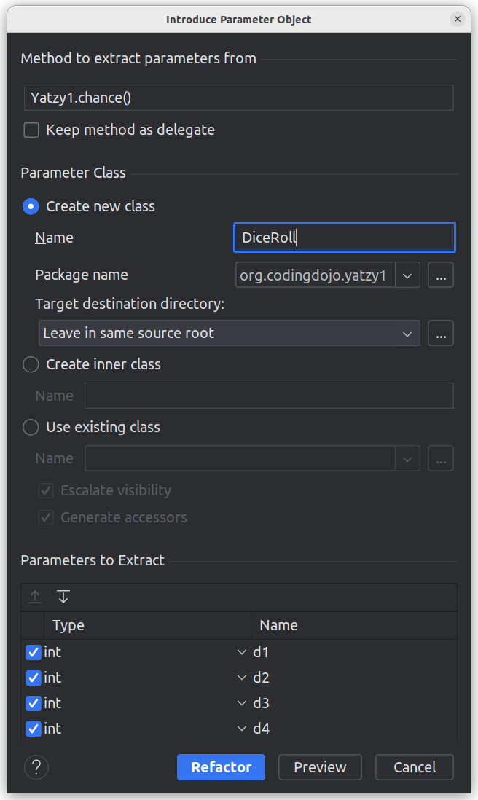
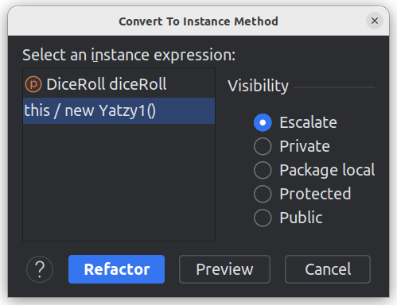
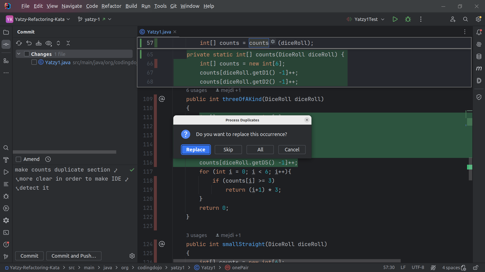

### Refactoring Yatzi

#### First Code Analysis

After watching the video and reading the rules, I took a first glance at Yatzy1 code. Here are my first impressions:

- All code is in a single file
- Code base is small : a total 239 lines
- No respect for object-oriented design principles : a lot of static methods
- Constructor is in the middle of class while it is usually the first thing we see in a class after fields (same remark
  for dices field)
- It seems there is a method for each game rule described by
  Emily [here](https://sammancoaching.org/kata_descriptions/yatzy.html). This is encouraging as developer seems to have
  respected the Single Responsibility Principle (at least at a certain level).
- All methods return the score which is an int.
- Some methods have the dices as input in the form of six ints. While other methods use the dices field of the class so
  do not have input. This will trouble the code reader
- Inconsistent naming of methods : some use snakeCase while other use camelCase. camelCase is commonly seen in python
  code but Java code usually uses camelCase.
- Some small code formatting issue(where the of { methods are put)
- There is unit Test that seems to be covering all methods which is great because we can refactor safely code.
  Otherwise, we will have to write the tests first.

#### Road Map Draft:

- Further analysis of game rules described by Emily
- Analyse and read the unit test
- Check code coverage to spot any missing edge case or method
- Establish a refactoring plan and prioritize the tasks. Some quick thoughts here:
    - move the constructor and field dices to first lines
    - create a class DiceRoll to represent the 5 dices
    - consisting naming using camelCase
    - all methods will use the class DiceRoll as their input. So we can remove the field dices from class
    - we can go further by creating in Interface ScoreCategory which calculate the score for each DiceRoll. Each
      implementation will represent a score category (chance, pair, ...). But this will come after the first pass I
      think.

#### Early Notes

The presence of unit test and the spotting of some easy to fix code flaws is encouraging since we could establish
quickly a first plan for code refactoring. Further analysis will be conducted after this first pass.

#### First Phase Progress

- Analysis of game rules described by Emily : Done
- Analysis unit test : Done (below details)
    - add edge case for each method
    - very small refactorings : inlining some variables, use assertEquals, move test to the wright method
    - renaming all tests using snake case. Each name is a phrase describing explicitly the game rule tested
    - analysing unit test manually shows that coverage is ok even if my IDE indicates that some lines of certain methods
      are not tested
- First production code refactoring : Done (below details)
    - move constructor and field up
    - renaming all methods using camelCase
    - make all methods static and receive as input the five dices
        - This will help us going further with refactoring and
          replacing the five ints with a the class DiceRoll or any other refactoring.
    - remove constructor and dices field

#### Second Phase Progress

- First careful analysis of production code logic and not just structure
- Identify some common patterns and clues to future refactorings
- Use Intellij IDE refactoring feature to extract DiceRoll class which is the input for all methods
- 
- Use Intellij IDE refactoring feature to make classes non static
- 

#### Third Phase Progress

- Refactor of methods `chance, ones, twos, threes, fours, fives` using streams
- Spotted some code logic duplication.
- Rewrite code to make it easier for IDE to identify duplicated blocks
- Use Intellij refactoring feature to remove duplicates and put them in a single static method `countOccurrences`
- 

#### Fourth Phase Progress

- move method `dices` to more `DiceRoll`
- rename method `countOccurrences` and add a unit test to better explain its role

#### Final Notes and Possible improvements

- code is clear enough for a developer to understand
- each method is self-contained and short enough to read
- further improvements can be done. But this can be over-engineering since code is clear enough for now :
    - make `DiceRoll` a record
    - add checks for dice sides in `DiceRoll` (only between 1 and 6)
    - refactor method `countOccurrencesOfSide` to make it return an object representing the occurrences of each side or
      number
    - create an in interface for game rules and create an implementation for each rule. We transform methods to
      interface implementations